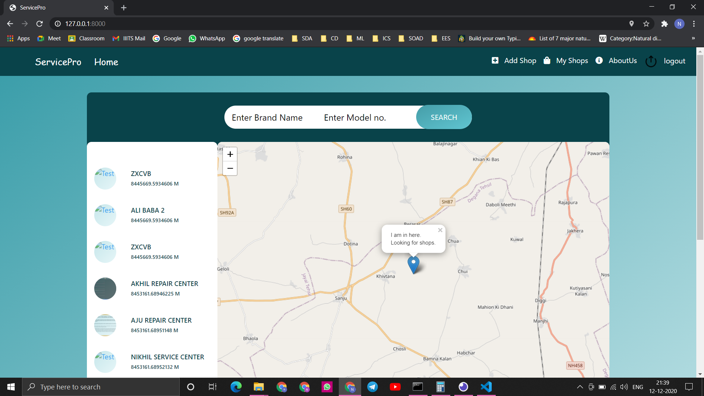
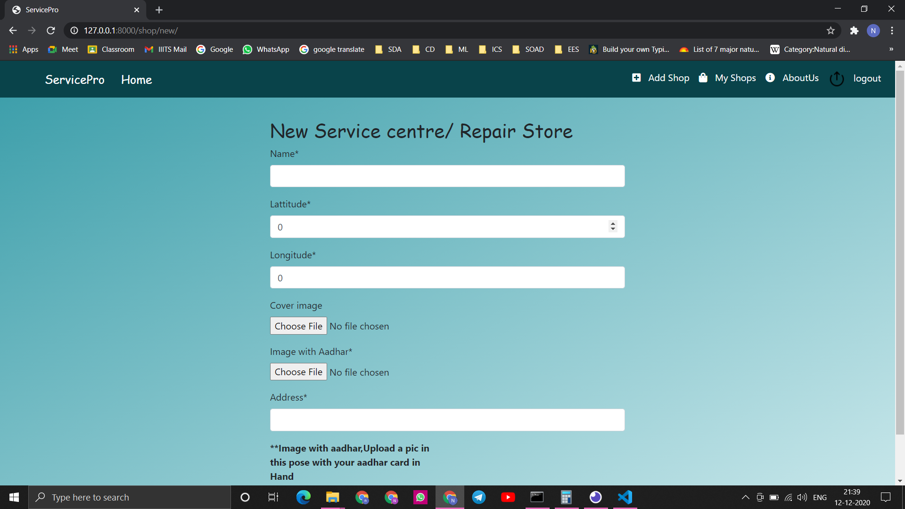
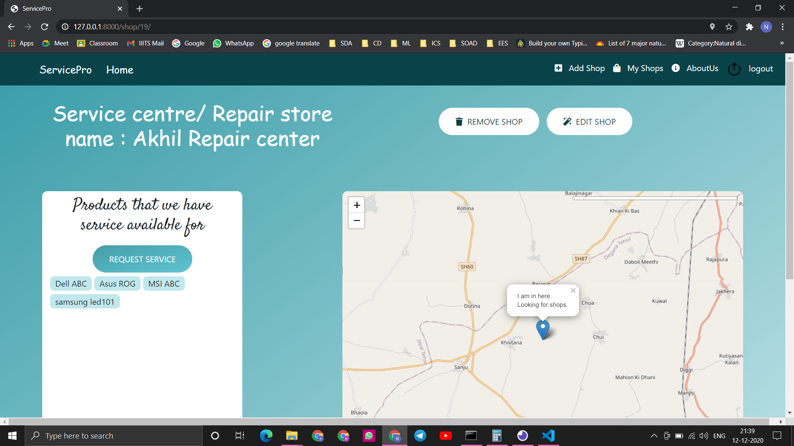
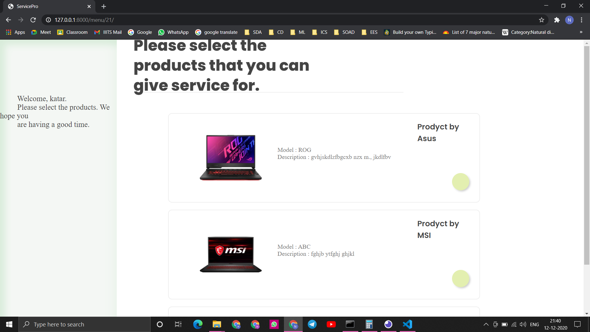
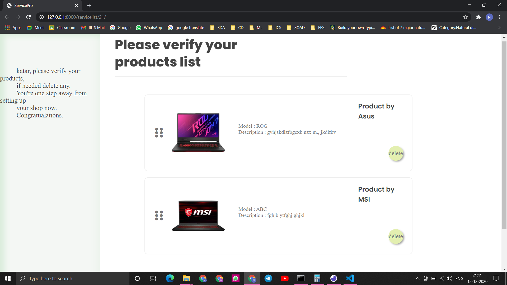
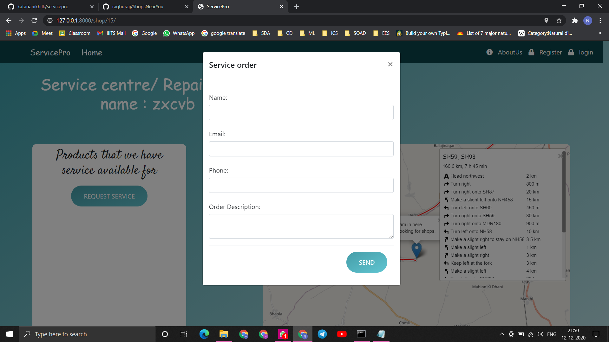
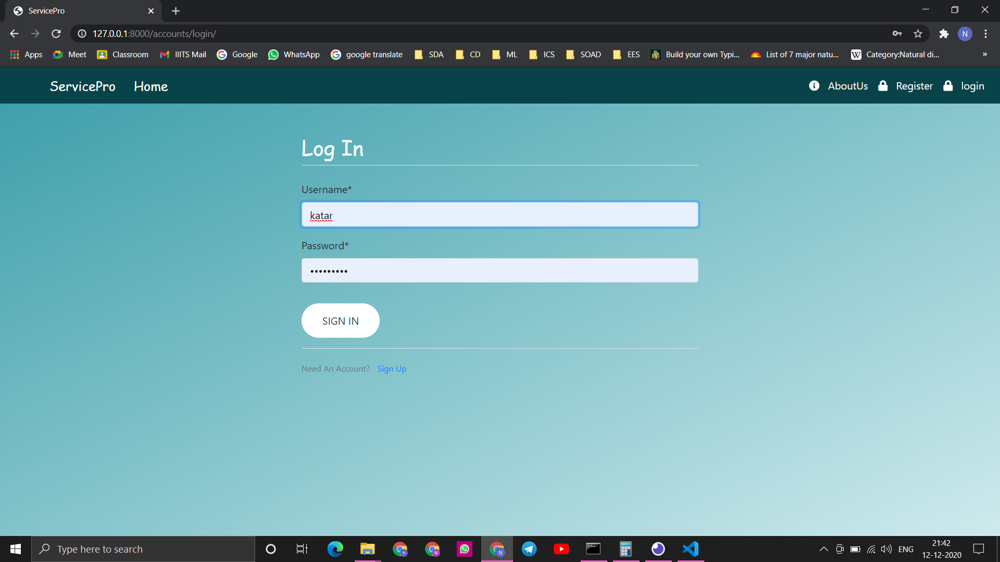
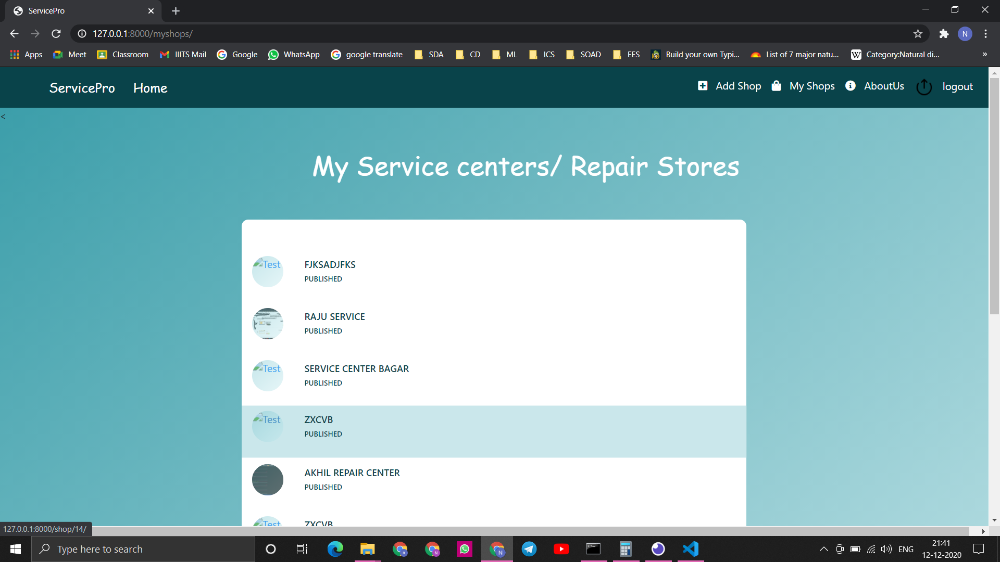
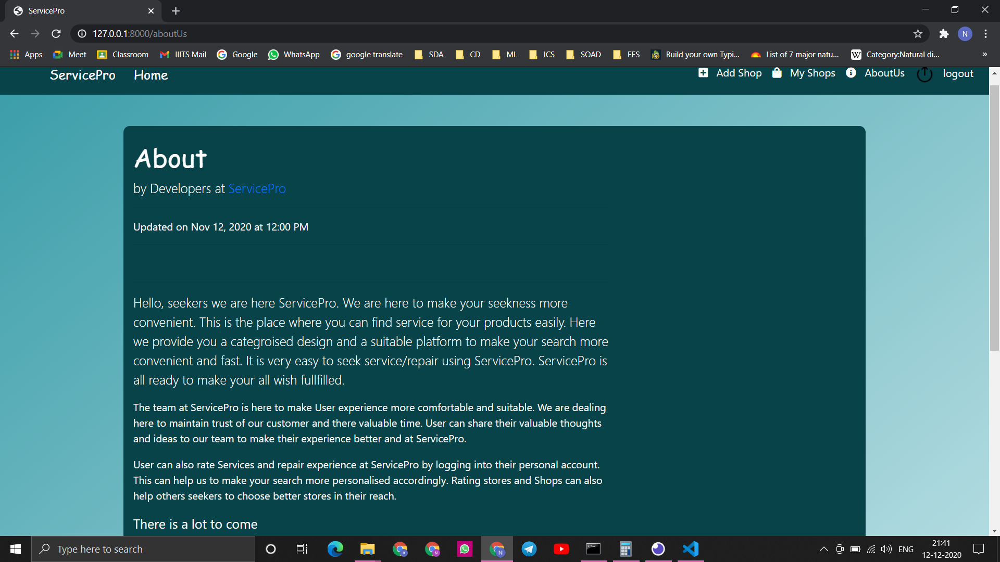

# NearByService
NearByService is a platfrom where customer can find service centers for top electronic brands. Service centers owners can add their servieces and servrice centers to our plateform NearByService. NearByService provide services and service centers list where customers can find the services and service centers according to the Items they need.

# Features
    -Service center owner can Add/Update/Delete their service center
    -Customers can search services and  list of service center by name of items they want
    -Service center will be shown on Maps and in a list with ascending order of distance.
    -Customers can give reviews to the service centers and its services
    -Service center owner can select the list product for which they are providing service
    -Customer can place service request for services for products with different service senters
    -login/signup
    -website is completely responsive
    
-Service Center Registration Page

-Service Center Detail Page

-Add Products List Page

-Services List Page

-Service order Page

-Log In Page

-Recently Used/ Personalised Service Center lists Page

-About Us Page

### Tech Stack
    -Django

### Database 
    -postgresql

### Swagger
    -https://app.swaggerhub.com/apis/iiits_darkmoon/ServiceCenterApi/1.0.0#free
  

